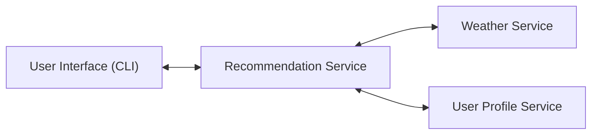

# 🌦 Weather-Activity-Recommender System

## Project Overview
The Weather Activity Recommender System is a microservice-based REST application that provides personalized activity suggestions based on real-time weather data and user preferences.

The system demonstrates key distributed systems concepts including:

- Microservice architecture
- RESTful APIs
- JSON-based communication
- External API integration
- Frontend-backend interaction


## Key Features
- Real-time weather data using OpenWeather API
- Personalized recommendations based on weather + user preferences
- Modular microservice design
- Simple web-based UI (HTML/CSS/JavaScript)
- Dynamic and randomized activity suggestions

  
## Architecture
The system is composed of three independent microservices:

### 1. Weather Service (Port 5000)
- Fetches real-time weather from OpenWeather API
- Normalizes response (temperature + condition)
- Returns structured JSON data

### 2. User Service (Port 5001)
- Stores user preferences
- Returns indoor/outdoor preferences

### 3. Recommendation Service (Port 5002)
- Core orchestrator service
- Combines weather + user data
- Generates personalized activity recommendations


## Architecture Diagram




## System Flow

1. User enters User ID and City in the web UI
2. Frontend sends request to Recommendation Service
3. Recommendation Service:
   - Calls Weather Service for live weather data
   - Calls User Service for user preferences
4. Weather Service fetches data from OpenWeather API
5. Services return JSON responses
6. Recommendation Service processes logic and selects activity
7. Result is displayed in the web interface


## Communication Design
- Protocol: HTTP
- Architecture Style: REST
- Data Format: JSON
- Interaction Type: Synchronous request/response

All services communicate using lightweight HTTP requests and exchange structured JSON objects.

  
## Weather Service
- Responsible for fetching and processing live weather data.

#### Endpoint:
GET /weather?city=<city>

## User Service
- Stores and retrieves user preferences.

#### Endpoints:
GET /user/<id>
POST /user/<id>

## Recommendation Service
- Generates personalized recommendations using:
   - Weather conditions
   - User preferences
   - Predefined activity dataset

#### Endpoint:
GET /recommend?userId=<id>&city=<city>

---


## Frontend
The frontend is built using:
- HTML (structure)
- CSS (modern glassmorphism UI)
- JavaScript (fetch API integration)

### Features
- User input form
- Dynamic API calls
- Live recommendation display


## Setup Instructions
### Step 1: Clone Repository
```bash
git clone https://github.com/drashti927/Weather-Activity-Recommender.git
cd Weather-Activity-Recommender
```

### Step 2: Install dependencies
```bash
pip3 install -r requirements.txt
```

### Step 3: Create .env file (in the root folder)
```bash
OPENWEATHER_API_KEY=your_api_key_here
```

### Step 4: Run Microservices (in separate terminals)
Terminal 1:
```bash
python3 src/weather_service.py
```
Terminal 2:
```bash
python3 src/user_service.py
```
Terminal3:
```bash
python3 src/recommendation_service.py
```

### Step 5: Run frontend (in a browser)
Open:
```bash
web/index.html
```


## How to Use
1. Enter User ID (e.g., 1)
2. Enter City (e.g., Pittsburgh)
3. Click "Get Recommendation"
4. View weather + personalized activity suggestion

## Technologies Used
1. Python (Flask)
2. OpenWeather API
3. HTML / CSS / JavaScript
4. REST APIs
5. JSON
6. Microservices Architecture
