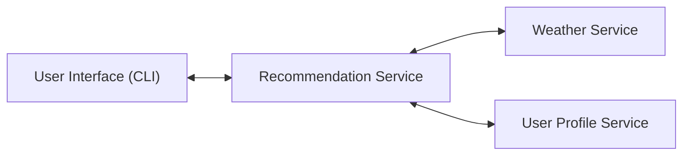

# 🌦 Weather-Activity-Recommender System

## Project Overview
This system is a microservice-based REST application that provides personalized activity recommendations based on real-time weather data.

It uses:
- Flask (backend microservices)
- OpenWeather API (real-time weather data)
- REST APIs (service communication)
- HTML/CSS/JavaScript frontend

It demonstrates distributed system design using REST APIs and JSON communication between independent services.

## Architecture
The system follows a microservice architecture, where each component is independent and communicates via REST APIs.

### 1. Weather Service (Port 5000)
- Fetches real-time weather from OpenWeather API
- Returns normalized weather data

### 2. User Service (Port 5001)
- Stores user preferences
- Returns indoor/outdoor preferences

### 3. Recommendation Service (Port 5002)
- Combines weather + user data
- Generates activity recommendations

---

## Frontend
Simple web UI built with:
- HTML
- CSS (modern glassmorphism design)
- JavaScript (fetch API)

---

## Setup Instructions

### 1. Clone the repository
```bash
git clone <your_repo_url>
cd Weather-Activity-Recommender

All services communicate using HTTP requests and exchange data in JSON format.

---

### Architecture Diagram



## Communication
- Protocol: HTTP
- Architecture Style: REST
- Data Format: JSON

## System Flow

1. User enters city and user ID in CLI
2. UI sends request to Recommendation Service
3. Recommendation Service calls:
   - Weather Service
   - User Profile Service
4. Services return JSON responses
5. Recommendation Service generates final output
6. Result is displayed in CLI

### Weather Service
- Fetches real-time weather using OpenWeatherMap API
- Returns normalized weather data

#### Endpoint:
GET /weather?city=<city>

### User Profile Service
- Stores user preferences (indoor/outdoor + activities)

#### Endpoints:
GET /user/<id>
POST /user/<id>

### Recommendation Service
- Combines weather + user data
- Generates recommendations

#### Endpoint:
GET /recommend?userId=<id>&city=<city>

### UI Client
- Simple CLI client to interact with system.
- Sends requests and displays results.
---

## How to Run
### Step 1: Install dependencies
```bash
pip3 install -r requirements.txt
```
### Step 2: Create .env file (in the root folder)
```bash
OPENWEATHER_API_KEY=your_api_key_here
```
### Step 2: Run Weather Service (in separate terminal)
Start Weather Service:
```bash
python src/weather_service.py
```
### Step 3: Run User Service (in separate terminal)
```bash
python src/user_service.py
```
### Step 4: Run Recommendation Service (in separate terminal)
```bash
python src/recommendation_service.py
```
### Step 5: Run frontend (in a browser)
```bash
web/index.html
```
## How to Use
1. Enter User ID (e.g., 1)
2. Enter City (e.g., Pittsburgh)
3. Click "Get Recommendation"
4. View weather + personalized activity suggestion
