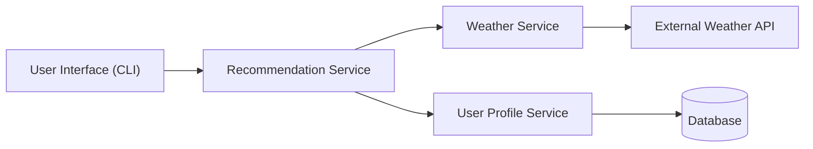

# System Architecture Design

## Overview
This system uses a microservice architecture where all services communicate via REST APIs using JSON.

## Architecture Diagram

## System Flow

UI sends request to Recommendation Service
Recommendation Service calls:
Weather Service
User Profile Service
Weather Service calls external API
User Profile Service accesses database
Recommendation Service returns result to UI

## Key Design Choice

Bidirectional communication ensures request/response flow across all services
