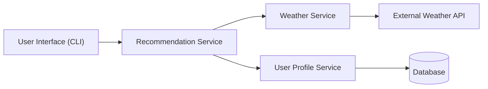

# System Architecture Design

## Overview
This system is designed using a microservice architecture, where each service is responsible for a specific function.

All services communicate using REST APIs over HTTP, and data is exchanged in JSON format.

## Architecture Diagram



# System Functionality

---

## User Interface (CLI)

* Accepts user input (user ID and city)
* Sends requests to the Recommendation Service
* Displays final recommendation output

---

## Recommendation Service (Core Service)

* Acts as the central orchestrator
* Retrieves data from Weather Service and User Profile Service
* Applies business logic to generate recommendations

---

## Weather Service

* Fetches real-time weather data from external API
* Normalizes weather response into usable format

---

## User Profile Service

* Stores and retrieves user preferences
* Maintains indoor/outdoor preference and activity list

---

## External Weather API

* Provides real-time weather data for requested cities

---

## Database

* Stores user profile information persistently

---

# System Flow

1. The user inputs a city name and user ID in the interface.
2. The UI sends a request to the Recommendation Service.
3. The Recommendation Service:

   * Requests weather data from the Weather Service
   * Requests user preferences from the User Profile Service
4. The Weather Service fetches data from an external API and formats it.
5. The User Profile Service retrieves user data from the database.
6. The Recommendation Service applies decision logic to generate a recommendation.
7. The result is outputted to the user.

---

# 🔌 Communication and Protocols

* **Protocol:** HTTP
* **Architecture Style:** REST
* **Data Format:** JSON

---

## 📡 Example API Endpoints

```id="x9kq2m"
GET /weather?city=Pittsburgh
GET /user/1
POST /recommendation
```

---

# Key Design Choices

## Microservice Separation

Each service is independent to improve scalability and maintainability.

## REST Communication

Services communicate using lightweight HTTP requests.

## External API Integration

Weather Service uses external APIs to ensure real-time data accuracy.


## Summaray
The system follows a modular microservice architecture where each service has a clear responsibility. The Recommendation Service acts as the principal component that integrates all data and generates personalized recommendations.
